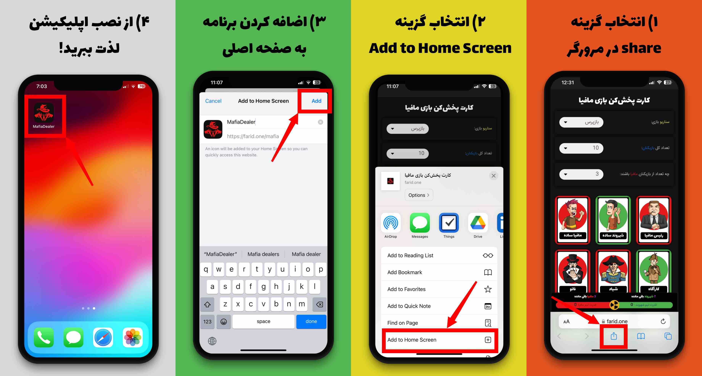

# کارت پخش‌کن بازی مافیا

<div style="text-align:center;">
  
</div>

### Setup as an app on iPhones:

<div style="text-align:center;">
  
</div>

### Install

Install nodejs:

```
asdf install nodejs 16.0.0
asdf local nodejs 16.0.0
```

Install dependencies:

```
npm install --save
```

Start the project:

```
npm start
```

Build the project:

```
npm run build
```
